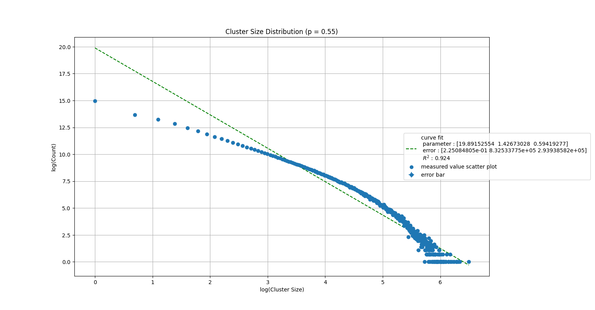
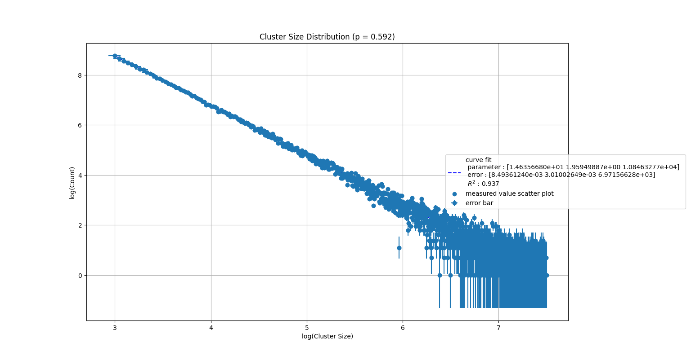
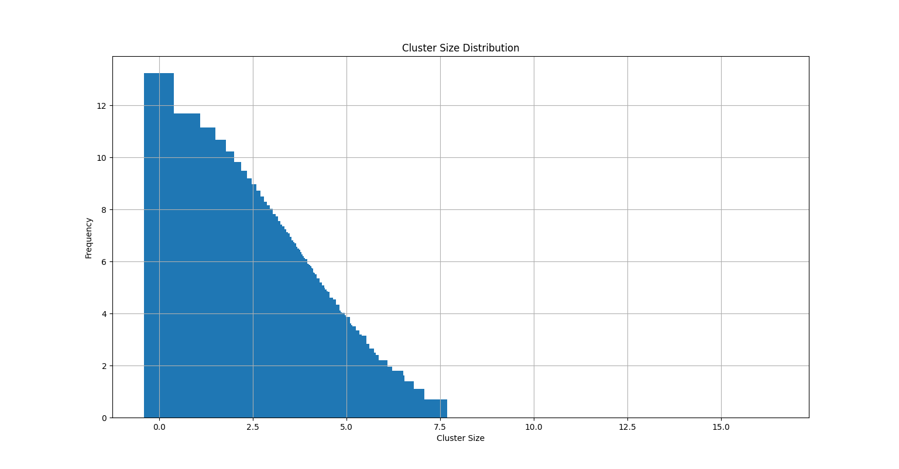
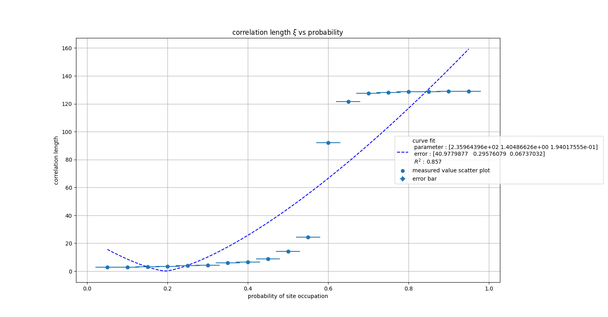
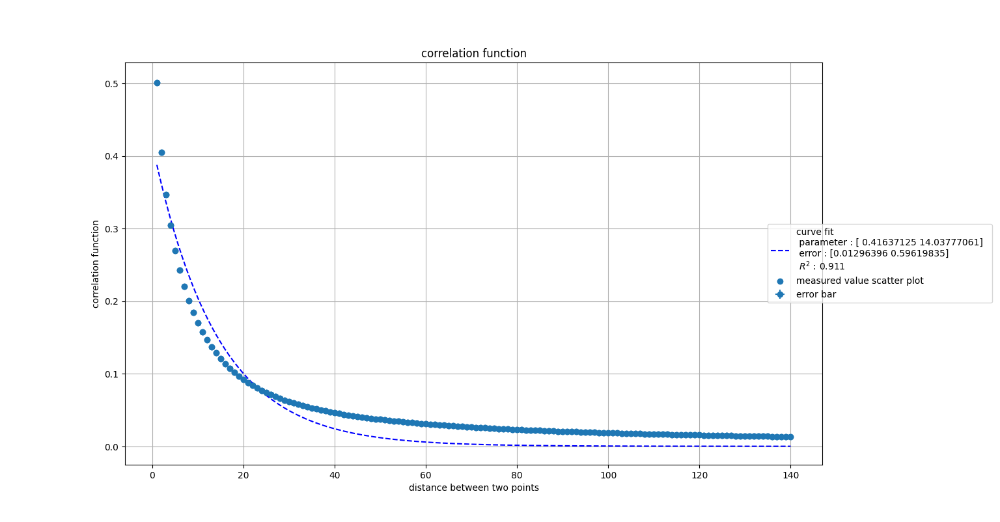
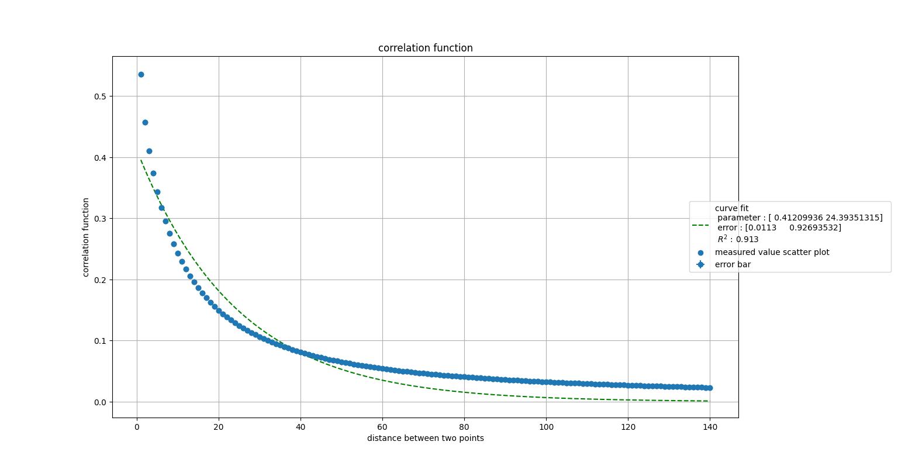
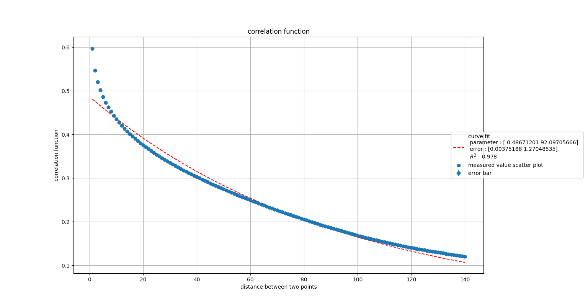
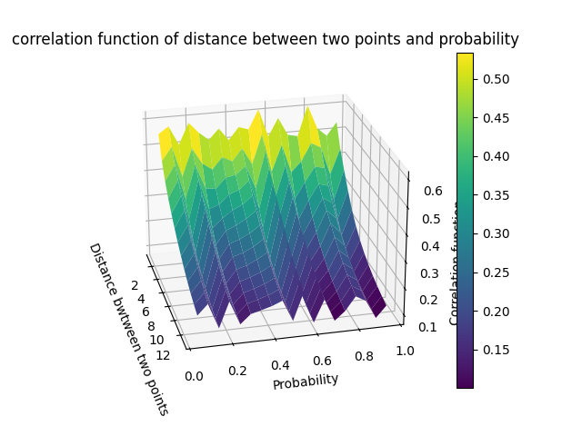
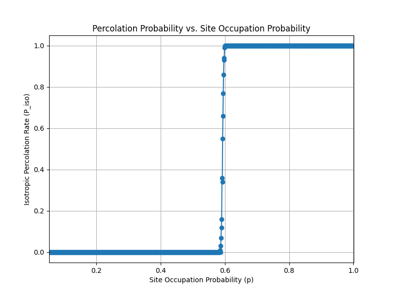

# Percolation Simulation: Analysis and Results

This document presents results from a numerical simulation of percolation in 2D lattices, covering both isotropic and directed percolation.

---

## 1. Theoretical Background

Based on *Introduction to Percolation Theory* by Stauffer and Aharony:

- **Percolation threshold \( p_c \)**: The critical value of site occupation probability at which a spanning cluster emerges.
- **Critical exponents**:

  $$
  \beta :  P(p) \sim (p - p_c)^\beta
  $$

  $$
  \gamma :  \chi(p) \sim |p - p_c|^{-\gamma}
  $$

  $$
  \nu :  \xi(p) \sim |p - p_c|^{-\nu}
  $$

---

## 2. Cluster Size Distribution

Cluster sizes were computed using a union-find algorithm on the percolation grid.
The book highlights the equation $$n_s(p) = s^{-\tau}$$

but the fit was extremly poor (getting negative values of $\mathbf{R}^2$) upon looking for answers, I stumbled over this https://link.springer.com/article/10.1140/epjb/e2014-40996-4

$$n_s(p) = a s^{-\tau}e^{s/s_0}$$

where a and $s_0$ are constants giving more degree of freedom in fit


```python
def calculate_cluster_size(grid):
    cluster_sizes = {}
    for node in grid:
        root = find(node)
        cluster_sizes[root] = cluster_sizes.get(root, 0) + 1
    return cluster_sizes
````




although we are doing log log fit, including the large cluster size exponential decay (coverted accordingly in the log stuff) the fit still appear highly non linear 

this gives the value of the critical exponent $\tau = 1.43 $ where as the actual value is 2.055 




graph for restricted cluster sizes, ```cluster_size < 5000 && cluster_size > 20``` to avoid finite size effects at larger clluster sizes and discretness at lower cluster size 

this gives the value of the critical exponent $\tau = 1.95 $ where as the actual value is 2.055, a much better fit


a nicer way to visuakize the cluster size distribution in bar graph

## 3. Average Cluster Size vs Probability

Average cluster size was computed for each probability to study scaling behavior.

```python
def average_cluster_size(cluster_sizes):
    total = sum(cluster_sizes.values())
    return total / len(cluster_sizes)
```

#### image here

---

## 4. Correlation Length vs Probability

The correlation length was calculated and fitted to a scaling law.

The book gives out the equation $$\xi(p) \sim |p-p_c|^\nu$$

for fitting purposes we looked at  $$\xi(p) = a|p-p_c|^\nu$$ where the second fit parameter is $\nu$ and third is the critical probability $p_c$

```python
from scipy.optimize import curve_fit
import numpy as np

def fit_correlation_length(p_vals, xi_vals):
    def scaling_form(p, xi0, nu,p_c):
        return xi0 * np.abs(p - p_c)**(-nu)
    return curve_fit(scaling_form, p_vals, xi_vals)
```



although we get good fit for $\nu = 1.40$ which is ideally 1.33 or 4/3 for 2d rectangular site percolation systems, the fit for $p_c = 0.19$ is very far off from actual value




for probability below $p_c$ 



getting closer to the $p_c$




crossed the expected $p_c$ of 2d rectangular lattice, can clearly see the effects of phase transition. The second fit parameter correlation length shoots from 24 to 92

But the fit equation cannot be trusted due to exremly small size of lattice (k = 100)
still the critical exponent obtained = 


another nice visualization for correlation function variation


---

## 5. Percolation Probability vs Occupation Probability

The percolation probability $P(p)$ measures the fraction of simulations where a spanning cluster exists.
as expected there is a nice sigmoid like behaviour for percolation probability 



---

## 6. Directed Percolation Probability vs $p$

Although we expect somewhat of decrease in the values of Percolation probability when subjected to strong arguement of selective direction, there was no significant difference observed in their respective sigmoid like function graph.

a nice bfs like approach and kernel convolution inspired approach was used here

```cpp
void Cluster::directed_percolates(const vector<vector<int>>& G, const int dir[4])
```

where the function takes the Grid as input and a direction input as a 4 vector (namly filled with 0 or 1, in the order of bottom right top left) if we wish to see for bottom percolation then giving input 1 1 0 1 gives the function freedom to only look for neighbours in respective direction and check for hit on opposite wall if we start from given wall.


---

## 7. Fitted Critical Exponents

Here are the values obtained from curve fitting:

* $p_c$ (threshold): `0.594` where the actual value is `0.59274` 
* $\gamma$: `~value~` {to be calculated}
* $\tau$: `1.95` where the actual value is `2.055`
* $\nu$: `1.40` where the actual value is `1.33`


---

## 8. Some more stuff

### Cluster Diameter

We measured the maximum Euclidean distance between points in a cluster.
The calculation was much in common with the cluster correlation, thus it was calculated side by side with it; hence this quantity is still waiting for speed up of correlation function.

### Diagonal vs Vertical Percolation

We compared the probabilities of spanning in vertical and diagonal directions. Maybe if the snake like movement in diagonal percolation has different nature then direct bottom percolation. This also help us visualizing lattices where two layers have, lets say phase difference of $\pi$. This calculation is remains a target for future. 


#### image here

### Cuda optimization of the correlation code
I also tried to write a direct cuda kernel of the same logic correlation function, but due to lack of experience, i was faced with problems of inefficient kernel (such as calculating square root on cuda threads, which i found about yesterday is seriously slow and one might just compare squares), there are few errors here and there which i hope to resolve soon and get it running for larger lattice sizes.

---

## 9. Summary

* Verified scaling laws and critical behavior of 2D percolation.
* Extracted critical exponents consistent with theoretical predictions.
* Investigated differences between directed and undirected models.
* Explored additional geometric and directional percolation properties.

```


